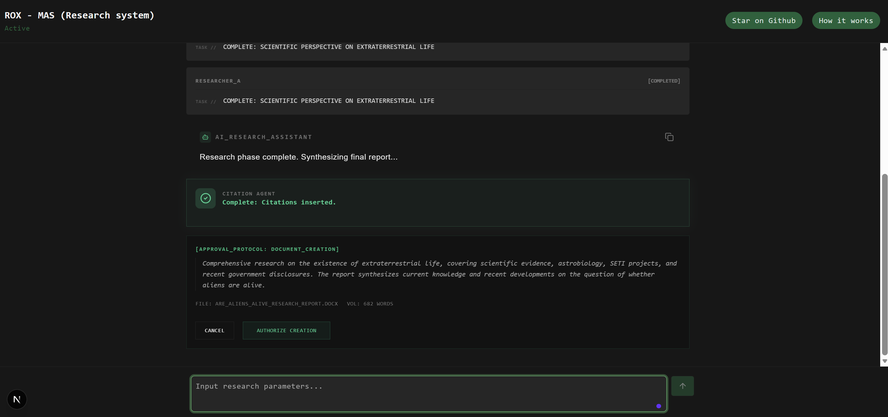
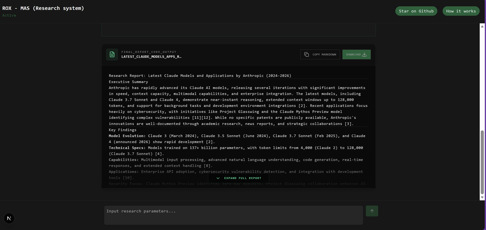
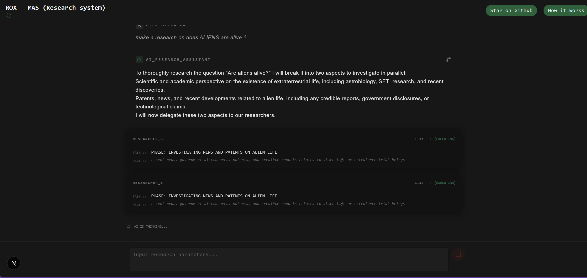
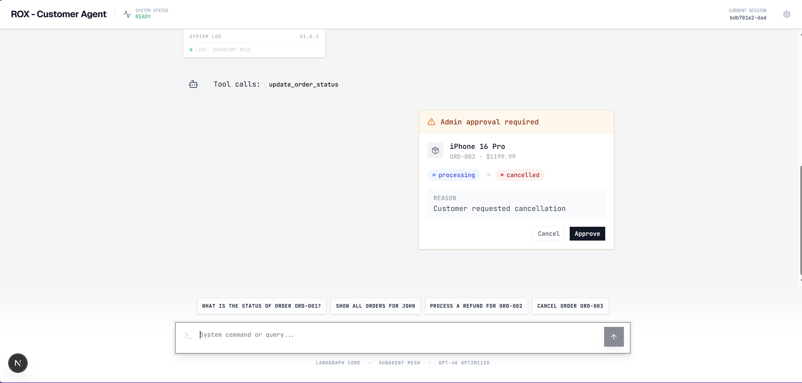

```
██╗      █████╗ ███╗   ██╗ ██████╗  ██████╗ ██████╗  █████╗ ██████╗ ██╗  ██╗
██║     ██╔══██╗████╗  ██║██╔════╝ ██╔════╝ ██╔══██╗██╔══██╗██╔══██╗██║  ██║
██║     ███████║██╔██╗ ██║██║  ███╗██║  ███╗██████╔╝███████║██████╔╝███████║
██║     ██╔══██║██║╚██╗██║██║   ██║██║   ██║██╔══██╗██╔══██║██╔═══╝ ██╔══██║
███████╗██║  ██║██║ ╚████║╚██████╔╝╚██████╔╝██║  ██║██║  ██║██║     ██║  ██║
╚══════╝╚═╝  ╚═╝╚═╝  ╚═══╝ ╚═════╝  ╚═════╝ ╚═╝  ╚═╝╚═╝  ╚═╝╚═╝     ╚═╝  ╚═╝
```
 
# 🧠 LangGraph Multi-Agent Systems with Nextjs connection. No SDK. No Templates, ALL CUSTOM BUILD
 
**The only repo where LangGraph agents run raw, stream real, and think deep.**
**Available in TypeScript AND Python. Because why choose one language when you can dominate both.**

---
## [VIDEO LINK](https://drive.google.com/drive/folders/1AnQJqup89w4W0im8wQxYoFJ6-_H7S88P?usp=sharing)
---
 
<!-- Agent Framework -->
[](https://langchain-ai.github.io/langgraph/)
[](https://langchain.com)
[](https://smith.langchain.com)
[](https://mem0.ai)
 
<!-- Languages & Runtime -->
[](https://www.typescriptlang.org/)
[](https://python.org)
[](https://nextjs.org)
 
<!-- LLMs -->
[](https://openai.com)
[](https://anthropic.com)
 
<!-- Tools & APIs -->
[](https://tavily.com)
[](https://serpapi.com)
[](https://firecrawl.dev)
 
 ---
 
## 📸 Screenshots
 
<div align="center">

  
  
  
  

 
</div>
---
---
 
⭐ **Star this repo if you're tired of wrapper tutorials.** ⭐
 
---
 
```
╔══════════════════════════════════════════════════════════════╗
║                                                              ║
║   📚  FOR LEARNING & TESTING PURPOSES ONLY                   ║
║                                                              ║
║   Got questions? Found a bug? Just wanna talk agents?        ║
║   Feel free to reach out — always happy to connect.          ║
║                                                              ║
║   📧  partapbhanu@gmail.com                                  ║
║   💼  https://www.linkedin.com/in/bhanu-partap13             ║
║                                                              ║
╚══════════════════════════════════════════════════════════════╝
```
 
---
## 🤝 Contributing

Feel free to fork, improve, and submit PRs!
If you like this project, give it a ⭐ on GitHub.
---
 
> **"Everyone wraps the SDK. We write the graph."**

## Why This Repo Stands Out

Most LangGraph examples are either basic chains or over-hyped demos with heavy abstractions.  

This project is different.

It showcases **real multi-agent reasoning** using **ReAct agents**, **interrupts**, **human-in-the-loop (HITL)** flows, and **custom streaming** — all connected through clean, production-minded architecture.

---

 
## 📁 Repository Structure
 
```
agents/
├── assets/                        # 📸 Screenshots & diagrams
│   ├── app1.png
│   ├── app2.png
│   ├── app3.png
│   └── dia-1.png
│
├── multi-research-client/         # 🔬 Research UI — real-time agent logs
├── multi-research-server/         # 🧠 The beast — 4-agent research orchestrator
│
├── .gitignore
├── README.md                      # You are here 📍
├── requirements.txt
└── tools_reference_card.html
```
## 💡 Key Concepts — For the Curious
 
<details>
<summary><b>🧠 What is a LangGraph StateGraph?</b></summary>
LangGraph models agents as directed graphs. Each **node** is a function that processes state. Each **edge** defines which node runs next — and edges can be **conditional**, meaning the agent decides its own path.
 
```python
graph = StateGraph(AgentState)
graph.add_node("reason", reasoning_node)
graph.add_node("act", tool_node)
graph.add_conditional_edges("reason", should_continue, {
    "continue": "act",
    "end": END
})
```
 
</details>
<details>
<summary><b>⏸️ What is Human-in-the-Loop (HITL)?</b></summary>
LangGraph can **interrupt** graph execution at any node, wait for human input, then **resume** from exactly where it stopped. State is fully preserved. This is how you build agents that ask for approval before taking irreversible actions.
 
```python
graph.add_node("refund_approval", interrupt(refund_node))
# Graph pauses here → Human approves → Graph resumes
```
 
</details>
<details>
<summary><b>🔄 What is a REACT Agent?</b></summary>
**Reason** + **Act** — a loop where the agent:
1. Reasons about what tool to call
2. Calls the tool
3. Observes the result
4. Reasons about next steps
5. Repeats until done
Not one shot. Not a chain. A **loop** with real decision-making.
 
</details>
<details>
<summary><b>🌊 Why raw SSE instead of the SDK?</b></summary>
The LangChain/LangGraph streaming SDKs are powerful — but they hide what's happening. Writing raw SSE means:
- You control every event that reaches the client
- You understand exactly what data flows and when
- You can customize the stream format for your UI
- No magic. No black boxes. **Full understanding.**
</details>
---


# 🔬 Multi-Research System
 
## Lead Agent → 2 ReAct Researchers → Citation Agent → HITL Docx. All Streaming.
 
> 4-agent research MAS. Real tool calls. Real sources. Cited report. Downloadable `.docx`. Max `MAX_ITERATIONS=3` research loops before forced synthesis.

# 🔑 Setup & Environment Variables

```bash

-- How to set up  (server side)--
poetry init
poetry install 
poetry run python server.py

-- How to set up  (client side)--
pnpm install
pnpm dev


-- server side
# LangSmith — Observability
LANGSMITH_TRACING=true
LANGSMITH_API_KEY=your_key
LANGSMITH_PROJECT=learning
 
# LLMs
OPENAI_API_KEY=your_key
ANTHROPIC_API_KEY=your_key
 
# Search & Scraping
TAVILY_API_KEY=your_key
SERPAPI_API_KEY=your_key
FIRECRAWL_API_KEY=your_key
 
# Memory
MEM0_API_KEY=your_key

-- client side
NEXT_PUBLIC_AGENT_URL=http://127.0.0.1:8000  (change as per your domain)
```
 
### Graph Architecture
 
```
              START
                │
       ┌────────▼──────────────────┐
       │       supervisor          │  ← gpt-4.1-mini (planning + synthesis)
       │  (Lead Researcher)        │    binds: ask_researcher_a
       │                           │           ask_researcher_b
       │  1. Plans research        │           create_document
       │  2. Delegates in parallel │
       │  3. Synthesizes findings  │
       │  4. Loops (max 3x)        │
       │  5. Calls create_document │
       └────────┬──────────────────┘
                │ assign_tool() — Send-based parallel fan-out
        ┌───────┴───────┐
        │               │
┌───────▼──────┐  ┌──────▼──────────┐
│ researcher_a │  │ researcher_b    │
│              │  │                 │
│ ReAct loop   │  │ ReAct loop      │
│ gpt-4.1-nano │  │ gpt-4.1-nano    │
│              │  │                 │
│ tavily_web_  │  │ tavily_web_     │
│ search       │  │ search          │
│ tavily_      │  │ serp_patent_    │
│ extract(url) │  │ search          │
│ serp_scholar_│  │ serp_news_      │
│ search       │  │ search          │
└───────┬──────┘  └──────┬──────────┘
        └───────┬─────────┘
                │  findings[] + ToolMessage → supervisor
       ┌────────▼──────────────────┐
       │       supervisor          │  decides: loop again OR call create_document
       └────────┬──────────────────┘
                │ assign_tool → Send("hitl_document", enriched_tool_call)
       ┌────────▼──────────────────┐
       │     hitl_document         │
       │                           │
       │  1. citation_agent runs   │  ← single LLM call, not ReAct
       │     (inserts [1][2]       │    regex extracts URLs from findings
       │      inline citations +   │    asks _subagent_llm to annotate
       │      ## References)       │
       │                           │
       │  2. interrupt(payload) ⏸️ │  ← graph FREEZES
       │     {summary, filename,   │    frontend shows approval card
       │      report_preview,      │    with word_count + citation badge
       │      word_count}          │
       │                           │
       │  3. On "approve":         │
       │     _write_docx() runs    │  ← writes Node.js script to /tmp
       │     → node script.js      │    uses docx npm library
       │     → {filename}.docx     │    structured headings, bullets, styles
       │     saved to /tmp/        │
       └────────┬──────────────────┘
                │ ToolMessage → supervisor → final response
       ┌────────▼──────────────────┐
       │       supervisor          │  END
       └───────────────────────────┘
```
 
### State (`ResearchState`)
```python
class ResearchState(MessagesState):
    research_plan: str                          # supervisor's breakdown
    findings: Annotated[list, operator.add]     # [{agent, aspect, query, summary}] — reducer appends
    active_statuses: Annotated[dict, operator.ior]  # per-agent live status — reducer merges
    hitl_data: dict                             # last interrupt payload (persistent for UI)
    final_report: str                           # cited markdown after synthesis
    iterations: Annotated[int, operator.add]    # loop counter, capped at MAX_ITERATIONS=3
    user_id: str
```
 
### Tools (real implementations)
 
**Researcher A tools:**
```python
tavily_web_search(query, max_results=5)  # search_depth="advanced", returns title+url+snippet
tavily_extract(url)                      # full raw_content up to 3000 chars
serp_scholar_search(query)               # google_scholar engine, 5 results, includes year
```
 
**Researcher B tools:**
```python
tavily_web_search(query, max_results=5)  # cross-verification searches
serp_patent_search(query)                # google_patents engine — short 3-6 word queries only
serp_news_search(query)                  # google tbm=nws, 5 results with source + date
```
 
### Custom Stream Events (per node)
```python
# researcher_a / researcher_b emit before and after their ReAct loop:
writer({"active_statuses": {
    "researcher_a": {"agent": "researcher_a", "status": f"Phase: Researching {aspect}",
                     "query": query, "start_time": time.time()}
}})
# is_done: True emitted on completion — UI clears the loading state
```
`hitl_document` also emits `citation_agent` status events and `doc_render` events — frontend tracks all 4 agents independently.
 
### Docx Generation
After HITL approval, `_write_docx()` writes a Node.js script to `/tmp`, executes it via `subprocess`, and uses the `docx` npm library to produce a structured `.docx` with proper heading styles, bullet numbering, font config (Arial 12pt), and page margins — not a plain text file.
 
### Edge Map
```
START → supervisor
supervisor →[assign_tool]→ researcher_a | researcher_b | hitl_document | END
researcher_a  → supervisor   (loop until MAX_ITERATIONS or create_document)
researcher_b  → supervisor
hitl_document → supervisor
```
`InMemorySaver` checkpointer. Mem0 integration scaffolded — ready to activate once OAuth `user_id` is available.
 
---

## ⚡ Streaming Architecture — How It Actually Works
 
```
Browser                Next.js              FastAPI              LangGraph
   │                      │                    │                     │
   │── fetch('/api/run')──►│                    │                     │
   │                      │──── POST /stream ──►│                     │
   │                      │                    │──── graph.astream ──►│
   │                      │                    │                     │
   │                      │                    │◄── node: "lead" ────│
   │◄── data: {node} ─────│◄── SSE event ──────│                     │
   │                      │                    │◄── tool_call ───────│
   │◄── data: {tool} ─────│◄── SSE event ──────│                     │
   │                      │                    │◄── token, token ────│
   │◄── data: {token} ────│◄── SSE event ──────│                     │
   │                      │                    │◄── END ─────────────│
   │◄── data: [DONE] ─────│◄── SSE event ──────│                     │
```
 
**Zero SDK wrapping the stream. Zero abstraction hiding the events.**
Raw `text/event-stream`. Raw `ReadableStream`. Raw power.


---
## 🤝 Contributing

Feel free to fork, improve, and submit PRs!
If you like this project, give it a ⭐ on GitHub.
